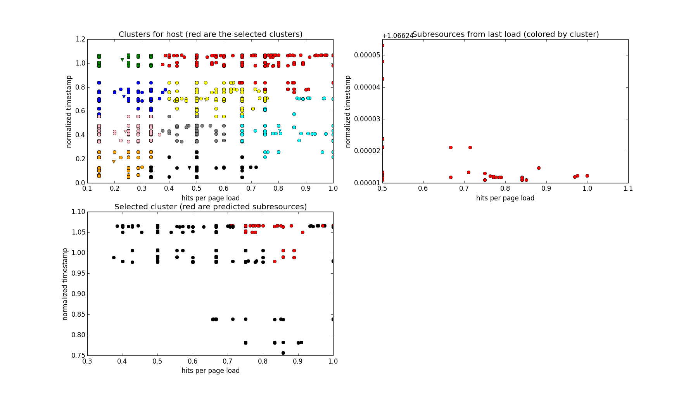

This repository contains my experiments for implementing predictive actions on
Necko with a different approach than the one taken on [Bug 881804](https://bugzilla.mozilla.org/show_bug.cgi?id=881804).

I'm doing this as a project for a machine learning class at university, and
learning a whole lot as I go. This means the code and ideas here are very likely
to suffer major changes over the next few weeks, but I'll try to keep this
document updated.

Also, given that this is a class assignment, it wouldn't be enough to limit my
work to improving the current implementation, which is why I'm intentionally
starting from scratch with a different approach. At the very least I hope
this will provide some ideas that can be considered when tweaking the current
prediction algorithm in the future.

# The initial problem

While the Network Seer in Bug 881804 is designed to take several different
predictive actions based on different events, such as loading pages on
browser start up and the user hovering a link, I chose to focus the core
problem that seems to involve most machine learning concepts:

> Given a page that is being loaded, attempt to predict the subresources (images,
> CSS, and JS files) that will be necessary in the near future by that page.

So basically I'm exploring an alternate implementation for the Predict method of
the Network Seer when a new page is loaded.

My plan is thus to keep the interface added by Bug 881804 and all calls to
Learn() that feed the Network Seer with data; if/when my method gets
implemented in the browser there will hopefully be no externally visible
changes.

# The idea

The basic idea is to group subresources with similar access patterns, and when a
known page is loaded, take predictive actions for the group that has the most
subresources that are needed for that page.

That is, on a page load, while the current prediction algorithm takes predictive
actions _exclusively_ for subresources that the page has loaded in the past, I'm
trying to load _most_ of those subresources, plus a few others that exhibit
a similar access pattern, hoping they will also be needed in the near future.

This added level of fuzziness could make the algorithm better suitable for
predicting not only the subresources for a page load, but for a _group_ of pages
loaded close together in time under a single host.

# The algorithm

At its core, the algorithm is basically an application of k-means clustering
that is pretty similar to previous work in text classification.

Broadly, whenever a page gets loaded and requests subresources, we make a note
of that (much like the existing Seer does). Then, for a given host, we cluster
the subresources loaded by all pages under that host. Whenever a known page is
visited, we can look up the cluster that has the majority of subresources that
page needed the last time it was loaded, and act on those.

Of course, as time passes we will want to account for pages changing and new
subresources appearing (and existing subresources getting older and less
relevant). My plan here is to use a sliding window of about two weeks: every so
often, we'll recalculate the clusters with the data from the past two weeks and
throw the old data away.

## Describing subresources

The k-means algorithm clusters together points in space that are close to each
other. If we're clustering subresources, we need to somehow describe them as
a feature vector.

Right now I'm using a two-dimensional vector to describe each subresource: a
timestamp and a _relative hit rate_, for lack of a better name.

The timestamp for a subresource is the last hit of that subresource _by any
page under a domain_ (remember, we're clustering subresources under a domain
regardless of the referring page). The timestamp is normalized using the length
of the sliding window, so it's a number between 0 and 1.

By throwing away older timestamps, I'm probably leaving out too much
information, so I'll reconsider this in the near future.

The relative hit rate is the number of times a given subresource has been
loaded, divided by the number of times the pages that loaded it were themselves
loaded. Aside from some weird corner cases, this is usually a number between 0
and 1.

Intuitively, the timestamp gives us a measure of global relevance for a
subresource -- how important it is for this whole host --, while the relative
hit rate gives us a local relevance -- how important this subresource is for
pages that need it.

One problem with calculating the relative hit rate as above is that a
subresource that is accessed 1000 times by 1000 pages, once by each page, has
the same rate as one that is accessed once by one single page.

To counter this, I'm considering summing a bias number to the denominator when
calculating the relative hit rate, such that new subresources start out with a
low relative hit rate, and subresources with a high relative hit rate are
guaranteed to be actually important. I'm currently looking for a good way to
derive an adaptive bias that can be changed every time the clustering is
re-made.

Note that all information we need here is already being collected by the Seer.

## Choosing a cluster

Whenever a known page is loaded, I'm simply looking up the cluster that contains
most of the subresources that were requested by that page _in its last load_. An
alternative could be to use the cluster that has most of the subresources the
page _has ever requested_; that's closer to what the Seer algorithm currently
does.

An interesting remark to be made here is that, while we don't expect all
subresources for a given page to fall on the same cluster, we do expect them to
group together to some extent -- as they obviously exhibit a similar access
pattern. In my (informal) tests, I have observed that that's indeed the case:
out of 6 clusters, the chosen cluster usually contains over 60% of the subresources.

The clustering also has the nice property that per-host "important"
subresources, those with high timestamp and relative hit rate, will cluster
together. Perhaps this "important" cluster can be used to take predictive
actions when a page that is _not_ known to the algorithm is first loaded.

Once a cluster (which is in essence a set of subresources) is chosen, it's still
unclear to me how to prioritize them when choosing which predictive action to
take for each.

## Hierarchical clustering

One problem I've experienced in my tests is that sometimes the generated
clusters are quite big, containing around a thousand subresources. I'm
experimenting with dividing each cluster into smaller subclusters and taking
enough subclusters to cover the set of subresources needed by the page.

This seems to reduce the number of subresources selected for predictive actions
by about half, but I still need to experiment with it some more.

# What it looks like

I've been casually gathering data by watching YouTube videos for the past weeks.
I'm not totally convinced YouTube is the best site to be gathering data at,
since video pages tend to be very different from one another, but it's a start.

This data was collected simply by running Firefox with the Seer patches applied
and copying the sqlite database from the profile directory. This database is at
`youtube.seer.sqlite` in this repository.

The script `moz_kmeans.py` implements the algorithm described in this document.
It uses a relative hit rate bias of 1.0, and hierarchical clustering with k = 6. Be
advised that the code, having been through constant change in the past weeks,
is... disorganized, to say the least. Its dependencies are opencv (for their
k-means implementation), matplotlib and numpy.

You can run it with:

`python moz_kmeans.py youtube.seer.sqlite <some page in the database>`

to simulate accessing that page. It should output some statistics and display a
few graphics displaying the clusters and the subresources that were predicted.

For example, this is what happens when you use page
<http://www.youtube.com/watch?v=Q8Tiz6INF7I>, which I only visited once, but was
the last one I visited:

Notice how, in the top leftmost graph, its subresources are fresh (high
timestamp) but, because of the bias, have only an average relative hit rate.

For this particular run (results may vary a little because k-means is not
deterministic), the selected cluster had 1224 subresources and contained 60
out of the 85 subresources the page loaded last time. Using hierarchical
clustering, we were able to narrow the number of subresources to predict down to
479. These statistics are printed to the terminal.

This is what happens with the oldest page in the dataset:

Notice how its subresources "floated down" in the graph as they got older and
were not shared by other pages. I expect subresources to float to the bottom
left as they lose importance.

Feel free to poke around with the other pages in the database; I'm fully aware
of how poor my musical taste is.

# Next steps

I still need to iron out the unanswered questions I documented here, and after
that I'd like to start working on some tentative patches for the browser.

I'm very open to any feedback, of course, and there's still time to change the
algorithm significantly if necessary.
