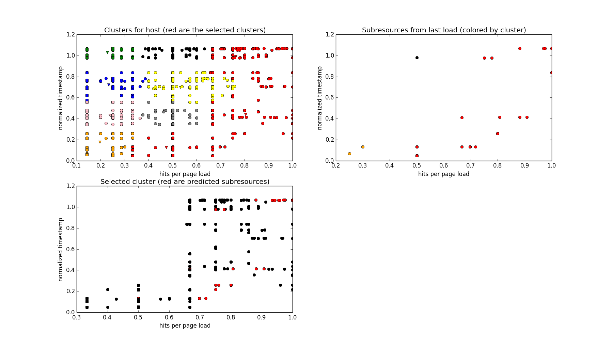

This repository contains my experiments for implementing predictive actions on
Necko with a different approach than the one taken on [Bug 881804](https://bugzilla.mozilla.org/show_bug.cgi?id=881804).

I'm doing this as a project for a machine learning class at university, and
learning a whole lot as I go. This means the code and ideas here are very likely
to suffer major changes over the next few weeks, but I'll try to keep this
document updated.

Also, given that this is a class assignment, it wouldn't be enough to limit my
work to improving the current implementation, which is why I'm intentionally
starting from scratch with a different approach. At the very least I hope
this will provide some ideas that can be considered when tweaking the current
prediction algorithm in the future.

# The initial problem

While the Network Seer in Bug 881804 is designed to take several different
predictive actions based on different events, such as loading pages on
browser start up and the user hovering a link, I chose to focus the core
problem that seems to involve most machine learning concepts:

> Given a page that is being loaded, attempt to predict the resources (images,
> CSS, and JS files) that will be necessary in the near future by that page.

So basically I'm exploring an alternate implementation for the Predict method of
the Network Seer when a new page is loaded.

My plan is thus to keep the interface added by Bug 881804 and all calls to
Learn() that feed the Network Seer with data; if/when my method gets
implemented in the browser there will hopefully be no externally visible
changes.

# The idea

The basic idea is to group resources with similar access patterns, and when a
known page is loaded, take predictive actions for the group that has the most
resources that are needed for that page.

That is, on a page load, while the current prediction algorithm takes predictive
actions _exclusively_ for resources that the page has loaded in the past, I'm
trying to load _most_ of those resources, plus a few others that exhibit
a similar access pattern, hoping they will also be needed in the near future.

This added level of fuzziness could make the algorithm better suitable for
predicting not only the resources for a page load, but for a _group_ of pages
loaded close together in time under a single host.

# The algorithm

At its core, the algorithm is basically an application of k-means clustering
that is pretty similar to previous work in text classification.

Broadly, whenever a page gets loaded and requests resources, we make a note
of that (much like the existing Seer does). Then, for a given host, we cluster
the resources loaded by all pages under that host. Whenever a known page is
visited, we can look up the cluster that has the majority of resources that
page needed the last time it was loaded, and act on those.

Of course, as time passes we will want to account for pages changing and new
resources appearing (and existing resources getting older and less
relevant). My plan here is to use a sliding window of about two weeks: every so
often, we'll recalculate the clusters with the data from the past two weeks and
throw the old data away.

## Describing resources

The k-means algorithm clusters together points in space that are close to each
other. If we're clustering resources, we need to somehow describe them as
a feature vector.

Right now I'm using a two-dimensional vector to describe each resource: a
timestamp and a _relative hit rate_, for lack of a better name.

The timestamp for a resource is the last hit of that resource _by any
page under a domain_ (remember, we're clustering resources under a domain
regardless of the referring page). The timestamp is normalized using the length
of the sliding window, so it's a number between 0 and 1.

By throwing away older timestamps, I'm probably leaving out too much
information, so I'll reconsider this in the future.

The relative hit rate is the number of times a given resource has been
loaded, divided by the number of times the pages that loaded it were themselves
loaded. Aside from some weird corner cases, this is usually a number between 0
and 1.

Intuitively, the timestamp gives us a measure of global relevance for a
resource -- how important it is for this whole host --, while the relative
hit rate gives us a local relevance -- how important this resource is for
pages that need it.

One problem with calculating the relative hit rate as above is that a resource
that is accessed 1000 times by 1000 pages, once by each page, has the same rate
as one that is accessed once by one single page. To counter this, I'm making
the denominator in that ratio _biased_ by adding a host-dependent value to it,
which is the mode of the number of hits for all pages in the host.

The intuition is that if, for a given resource, all pages that load it have a
total number of hits not much larger than 5, and if for that host most pages
have 5 hits by themselves, then either that resource has been accessed by not
many more than one page, or it has been accessed by several pages that have
extraordinarily low number of hits. Either way, the resource is penalized, even
though it may have been hit 5 times and would have had a relative hit rate of
1.0 if it wasn't for the bias.

I also experimented a bit with using a measure of sharing -- for each resource,
the number of pages that load it, divided by the total number of pages in the
host. However, since for many hosts, and YouTube in particular, there is little
resource sharing among different pages, this ratio turned out to be very small
and to have very little variance, so it was difficult to normalize and handle. I
may revisit this later, but for now I'm hoping most of the 'sharing' information
is captured by the biased relative hit rate.

Note that all information we need here is already being collected by the Seer.

## Choosing a cluster

As issue 1 pointed out, it is important for the prediction algorithm to actually
predict most of the resources that are known to be associated with a given page
when that page is loaded. I have since attempted to improve the algorithm in
that direction, while still maintaining a (configurable) amount of fuzziness.

Whenever a known page is loaded, we're looking up the three clusters that best
cover the resources that were requested by that page _in its last load_. An
alternative could be to use the cluster that has most of the resources the page
_has ever requested_; that's closer to what the Seer algorithm currently does.

Then, the subclusters under those selected clusters are considered recursively:
we pick the three that best cover the resources that were covered in the
previous step, and use them, along with the covered resources, as a prediction.

Thus in the first cluster selection we're narrowing down (or shrinking) our
search space from all resources under that host to those that best correlate
with the page. Then in the second cluster selection we grow the group of
predicted resources from the ones covered (which are typically over 90% of the
ones actually loaded by the page) by adding some other, related resources.

Since we may not want this growth to be unbounded, as we only pick whole
subclusters and even with hierarchical clustering some subclusters have over
400 resources, we're only picking enough resources so that the total prediction
size is smaller than 1.5 times the covered resources. There may be a smarter way
to do this without resorting to the 0-1 knapsack problem like I am.

The clustering also has the nice property that per-host "important" resources,
those with high timestamp and relative hit rate, will cluster together. So when
a page that is _not known_ is requested, one option could be to pick the
clusters and subclusters that are closer to point (1, 1) in the same recursive
way we do for known pages, and use that as a prediction. This behavior is
currently implemented in this repository as well.

# What it looks like

I've been casually gathering data by watching YouTube videos for the past weeks.
I'm not totally convinced YouTube is the best site to be gathering data at,
since video pages tend to be very different from one another, but it's a start.

This data was collected simply by running Firefox with the Seer patches applied
and copying the sqlite database from the profile directory. This database is at
`youtube.seer.sqlite` in this repository.

The script `moz_kmeans.py` implements the algorithm described in this document.
It uses 10 clusters, and 10 subclusters for each of these clusters. Its
dependencies are opencv (for their k-means implementation), matplotlib and
numpy.

You can run it with:

`python moz_kmeans.py predict youtube.seer.sqlite <some page in the database>`

to simulate accessing that page. It should output some statistics and display a
few graphics displaying the clusters and the resources that were predicted.

For example, this is what happens when you use page
<http://www.youtube.com/watch?v=Q8Tiz6INF7I>, which I only visited once, but was
the last one I visited:

Notice how, in the top leftmost graph, its resources are fresh (high
timestamp) but, because of the bias, have only an average relative hit rate.

I haven't had time to make this visualization better after changing the
algorithm to pick multiple clusters instead of one, so right now you can't
really see which individual clusters were picked inside the red mass of three
clusters. Sorry about that.

For this particular run (results may vary a little because k-means is not
deterministic), 123 resources were predicted, containing all 85 resources that
were requested by the page when it was last loaded. These statistics are
printed to the terminal.

This is what happens with the oldest page in the dataset,
<http://www.youtube.com/watch?v=jJj0FAUcqj4>:

Here, 80 resources were predicted, out of which 56 had been loaded by the page
last time it was loaded. The total number of resources loaded by the page in its
last load was 59, so the prediction brought in 94.92% of those.

Feel free to poke around with the other pages in the database.

The script `plot_predicted_and_explicit.py` also plots some aggregate statistics
for the whole database. It can be run with:

`python plot_predicted_and_explicit.py youtube.seer.sqlite <some page regex>`

It will then request predictions for all pages that match the regex and plot the
relationship between the resources that the page actually loaded in its last
load (called the _explicit_ resources here) and the ones predicted.

These are the graphs for when we run:

`python plot_predicted_and_explicit.py youtube.seer.sqlite 'http://www.youtube.com/.*'`

The top left graph shows how the number of predicted resources grows linearly
with the number of explicit resources. This was a very ugly scattered plot
before I implemented the different cluster picking algorithm.

The top right histogram shows the size of the explicit set of resources when
compared to the set of predicted resources; the closer that is to 1, the less
fuzzy we're being. All bins are above 0.65 because of the growth limiting in
described above.

Finally, the bottom left histogram shows the accuracy of the algorithm: the ratio of
explicit resources that were also predicted. For almost all pages that
ratio is over 0.8, which means 80% of the explicit resources were predicted.

Note that we could also bring this ratio up to 1.0 artificially by always
predicting all resources from the last load, along with the cluster cover, if
necessary.

Finally, the `moz_kmeans.py` script can be made to watch a given database, with:

`python moz_kmeans.py watch <database file>`

This will make it recalculate the clusters and predictions for all known pages
every minute, and dump it all in two new tables -- `moz_page_predictions` and
`moz_host_predictions`. My [mozilla-central
tree](https://github.com/guilherme-pg/mozilla-central/tree/network-seer)
contains a patched version of the Seer that uses these tables for the
predictions, so we can actually run the browser using my algorithm for testing.

# Next steps

I think the next step would really be to figure out a way to test the effect of
this algorithm versus the current one. Maybe an interesting baseline would also
be to predict all resources from a page's last load, always.
